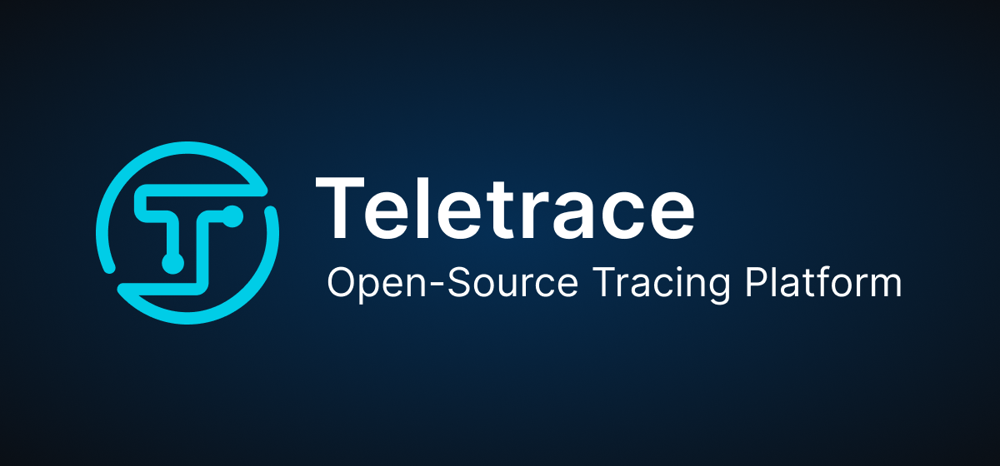

<div align="center">
  <a href="https://docs.teletrace.io/" target="_blank">
  <picture>
    
  </picture>
  </a>
</div>

<h3 align="center">
  <a href="https://docs.teletrace.io/"><b>📝 Explore the docs</b></a> &bull;
  <a href="https://join.slack.com/t/teletrace/shared_invite/zt-1qv0kogcn-KlbBB2yS~gUCGszZoSpJfQ"><b>💬 Join Our Slack</b></a> &bull;
  <a href="https://github.com/teletrace/teletrace/issues/new?assignees=&labels=&template=bug_report.md&title="><b>🐛 Report Bug</b></a> &bull;
  <a href="https://github.com/teletrace/teletrace/issues/new?assignees=&labels=&template=feature_request.md&title="><b>✨ Request Feature</b></a>
</h3>

## ⭐️ **Why Teletrace?**

Teletrace is built from the ground up for modern applications. It is open-source and relies on open standards like OpenTelemetry. It is an easy-to-deploy scalable solution, that supports multiple storage options.

## ✨ **Features**

- Advanced search to pinpoint slow and failing requests.
- Visualize requests to understand their context in your application.
- Track user requests and data across your application.

## 🖼 **Demo**


## 📚 **Table of contents**

- [Features](#-features)
- [Demo](#-demo)
- [Getting Started](#-getting-started)
- [Contribution](#-contribution)
- [Community](#-community)
- [Code of Conduct](#-code-of-conduct)
- [License](#-license)

## 🚀 **Getting started**

### Requirements

- [Docker](https://docs.docker.com/compose/install/)

### Using Docker

Using docker-compose:

```sh
curl https://raw.githubusercontent.com/teletrace/teletrace/main/deploy/docker-compose/teletrace-otel-collector.yaml > teletrace-otel-collector.yaml && \
curl https://raw.githubusercontent.com/teletrace/teletrace/main/deploy/docker-compose/docker-compose.yml > docker-compose.yml && \
docker-compose up
```

Alternatively, using docker CLI:

```sh
curl https://raw.githubusercontent.com/teletrace/teletrace/main/teletrace-otelcol/config/all-in-one-config.yaml > all-in-one-config.yaml && \
docker run \
    -v $(pwd)/all-in-one-config.yaml:/etc/config.yaml \
    -p 8080:8080 \
    -p 4317:4317 \
    -p 4318:4318 \
    teletrace:latest \
    --config /etc/config.yaml
```

## 💬 **Community**

Join our [Slack](https://join.slack.com/t/teletrace/shared_invite/zt-1qv0kogcn-KlbBB2yS~gUCGszZoSpJfQ) for questions, support and fun.

Start with our [Documentation](https://docs.teletrace.io/) for quick tutorials and examples.

If you need direct support you can contact us at teletrace@cisco.com.

## 👨‍💻 **Contribution**

Contributions are welcome!

Start by reviewing the [contribution guidelines](CONTRIBUTING.md). After that, take a look at a [good first issue](https://github.com/teletrace/teletrace/issues?q=is:issue+is:open+label:%22good+first+issue%22).

[](https://github.com/teletrace/teletrace/graphs/contributors)

Thank you to all the people who already contributed to Teletrace ❤️

## ❗ **Code of conduct**

We take our community seriously and we are dedicated to providing a safe and welcoming environment for everyone.
Please take a few minutes to review our [Code of Conduct](./CODE_OF_CONDUCT.md).

## 🪪 **License**

Copyright (c) Cisco Systems, Inc. [Apache 2.0 License](./LICENSE).
