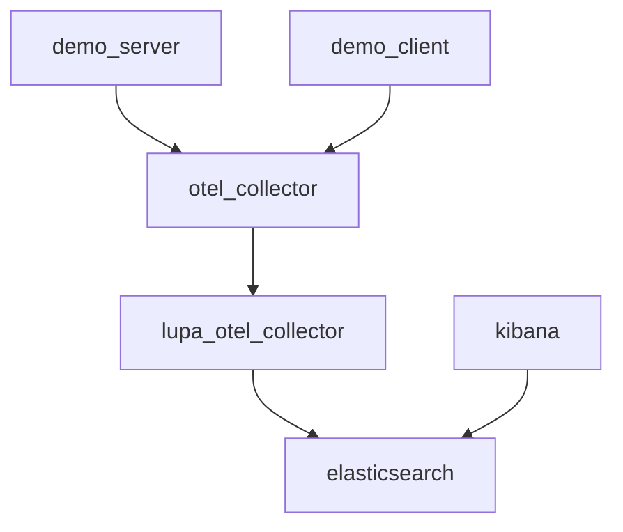

# all-in-one demo

Relays on the [official OTel collector demo](https://github.com/open-telemetry/opentelemetry-collector-contrib/tree/main/examples/demo).



## Usage

```sh
docker compose up -d
```

- UI - http://localhost:8080/
- API - http://localhost:8080/v1/ping
- Kibana (for accessing ingested traces) - http://localhost:5601/
