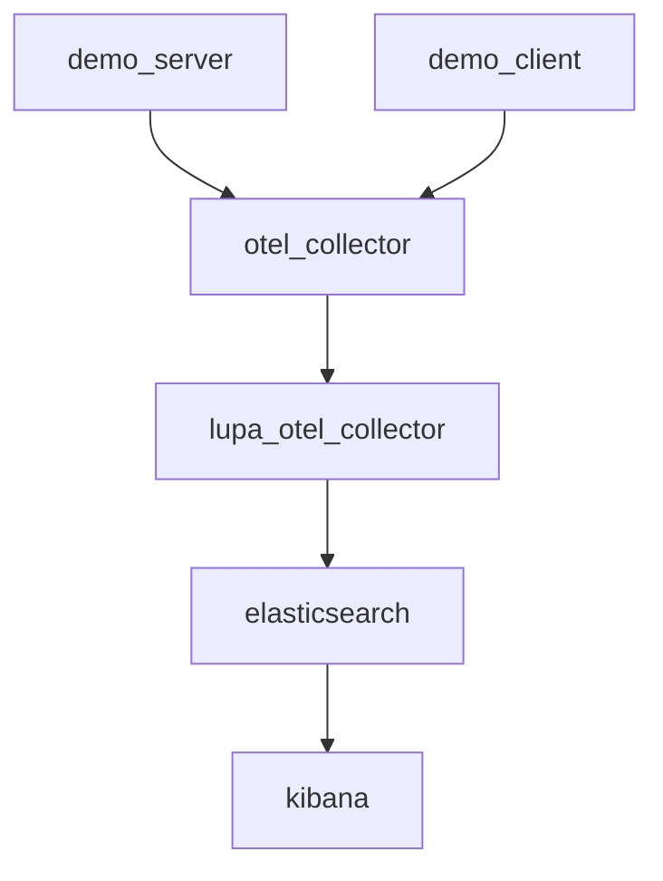

# all-in-one demo

Relays on the [official OTel collector demo](https://github.com/open-telemetry/opentelemetry-collector-contrib/tree/main/examples/demo).



## Usage

```sh
docker compose up -d
```

- UI is available at http://localhost:8080/
- Use Kibana (http://localhost:5601/) to access the ingested spans.
