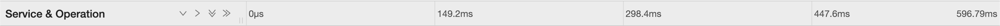

# Trace Timeline Components

## TracePage

In Jaeger context, the TracePage represents the top hierarchy, containing all of the elements required to display various representation of the same trace:

<p align="center">
  
</p>

### TracePageHeader

<p align="center">
  
</p>

### TraceTimelineViewer

<p align="center">
  
</p>

#### TimelineHeaderRow

<p align="center">
  
</p>

#### VirtualizedTraceView

<p align="center">
  
</p>

## Redux and React Versioning + Refactoring

Most of the PR's heavy lifting stems from upgrading react & redux versions. Thus, the current PR currently working with an updated React version (18.x.x) and @reduxjs/toolkit.

## Changes Markup

Changes are marked as:
`// ** CHANGED <description> **`

## Suggestion

- VirtulizedTraceView has yet to be imported - once resolving the redux issues with the TimelineHeaderRow, it should be easier to keep importing parts of the Jaeger project incliding the TracePageHeader and the VirtualizedTraceView. Also, currently there is a compilation error due to SpanTreeOffset which is supposed to be default exported using the connect function from 'react-redux'.

- Using a better approach for the redux parts of the project by compartmentalization the state - for example, TimelineHeaderRow requires actions associated with:

```
setSpanNameColumnWidth, expandAll, expandOne, collapseAll, collapseOne
```

Hence, i declared an action type of HeaderRowActions:

```
export type HeaderRowActions = ReturnType<
typeof setSpanNameColumnWidthAction |
typeof expandAllAction |
typeof expandOneAction |
typeof collapseAllAction |
typeof collapseOneAction>;
```

Same can be made for

```
detailLogItemToggle, detailLogsToggle, detailProcessToggle,detailReferencesToggle,detailWarningsToggle, detailStates, detailTagsToggle,detailToggle,
```
