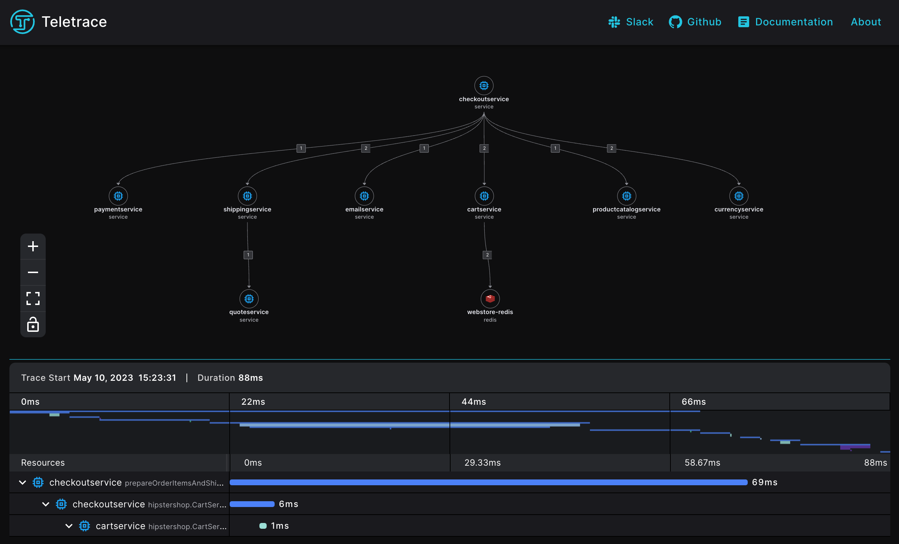

# Distributed Tracing

Distributed tracing is a technique used in software systems to trace requests as they flow through multiple services or components of a distributed application. It is used to diagnose and debug complex issues that may arise in distributed systems, where a request can travel through multiple services before it is fulfilled.

In a distributed tracing system, a unique identifier, called a trace ID, is assigned to each request as it enters the system. As the request flows through different services, each service creates a span, which is a record of the time spent processing that request. Each span is associated with the trace ID, allowing the tracing system to reconstruct the entire request path through the system.

<figure markdown>
  {width="600"}
  <figcaption>example trace</figcaption>
</figure>

Spans are created by instrumentation libraries that are included in the application.

A span represents a single operation within a trace,
it contains a start and end time, a unique identifier, the name of the operation, and any relevant in its Attributes, for example:

| Attribute Name            | Attribute Value                            |
| ------------------------- | ------------------------------------------ |
| `db.system`               | redis                                      |
| `db.redis.database_index` | 0                                          |
| `db.redis.flags`          | DemandMaster                               |
| `db.statement`            | HMSET ef00fdce-ef3c-11ed-a06a-fa7627f72bbb |
