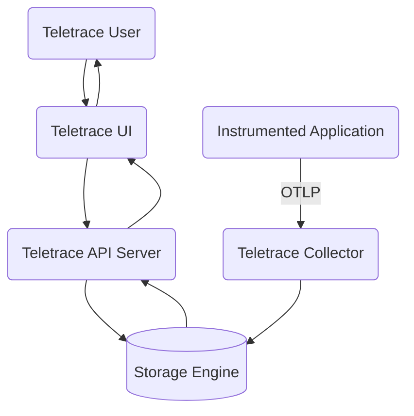
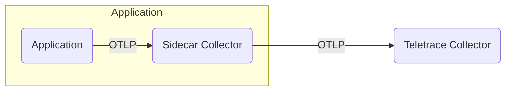

# Architecture Overview

The Teletrace application is comprised of 4 main components:

1. Teletrace UI
2. Teletrace API server
3. Custom OpenTelemetry Collector distro (Teletrace Collector)
4. Storage Engine

Each of these components can be deployed and scaled independently but we distribute an `all-in-one` container 
image that will deploy the `teletrace-ui`, `teletrace-api-server` and `teletrace-collector` in a single image to ease deployment.

In this overview we will go over each of the main components, explain their use and why they are needed.

## Teletrace UI

The Teletrace UI is a modern React based SPA used to query, fetch and visualize the traces that have been stored in the storage engine.

## Teletrace API Server

The Teletrace API Server is the main processing unit when querying and searching for traces,
it is responsible for finding the right traces, and constructing a correct trace relations graph.

Like all components it is extendible through the use of plugins,
and can be scaled horizontally to handle higher throughputs,
but since this component is only responsible for data fetching it's resource use are much lower then the collector which needs to handle _all_ incoming traces.

## Teletrace Collector

The Teletrace collector is the main entry point for traces ingestion,
it is a custom built OpenTelemetry Collector distro with includes all of Teletrace's exporters to work with our internal storage format,
this component will store the incoming traces in the configured storage engine.

Traces that are exporter from your instrumented code should be sent to the Teletrace Collector,
either directly or through an intermediary OpenTelemetry Collect.

### Multiple Collectors vs Single Collector

While in most cases you should probably use multiple collectors when tracing,
if your deployment is rather simple and contained mainly in a single cluster,
you can start off using a single collector and scaling out from there.

#### Using multiple collectors for trace processing and filtering

The OpenTelemetry Collector can be used to process and / or filter incoming traces,
while this processing can also be done in a centralized collector it is more beneficial to move this processing as close to the component which generates the trace,
that way you will reduce the overall network bandwidth used,
which can get very costly if you send traffic between different clusters and across VPCs.

The processing or filtering is done using OpenTelemtery Collector `processor` components which can be found in the OpenTelemetry Collector [Contrib Repo](https://github.com/open-telemetry/opentelemetry-collector-contrib/tree/main/processor).

A few popular processors include:

- [Filter Processor](https://github.com/open-telemetry/opentelemetry-collector-contrib/tree/main/processor/filterprocessor) which can filter out unwanted spans.
- [Attributes Processor](https://github.com/open-telemetry/opentelemetry-collector-contrib/tree/main/processor/attributesprocessor) which can modify / add / remove span attributes.
- [Tailsampling Processor](https://github.com/open-telemetry/opentelemetry-collector-contrib/tree/main/processor/tailsamplingprocessor) which can sample traces to reduce the overall volume of traces.

#### Sidecar Pattern

While we include _some_ `processors` in the Teletrace collector,
its main focus is not to process traces, but to be a central exporter for **processed** spans,
so to do all the processing and filtering a very common pattern to use is the _Sidecar Pattern_,
in which you **inject** an OpenTelemetry Collector instance to run right next to your container (in the same pod for example in K8s).

The traces will initially be sent to the sidecar collector which will do all the necessary processing like
filtering, sampling, attribute enrichment etc. and then will send the spans to the central Teletrace collector.

